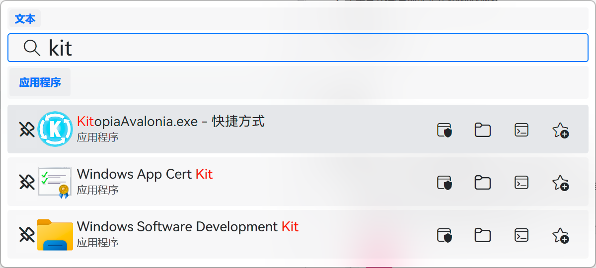
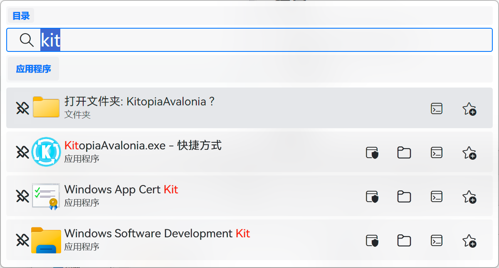
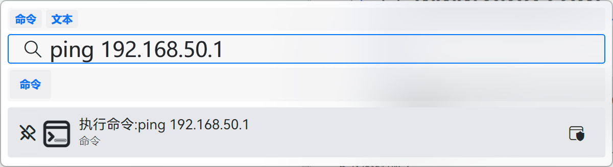
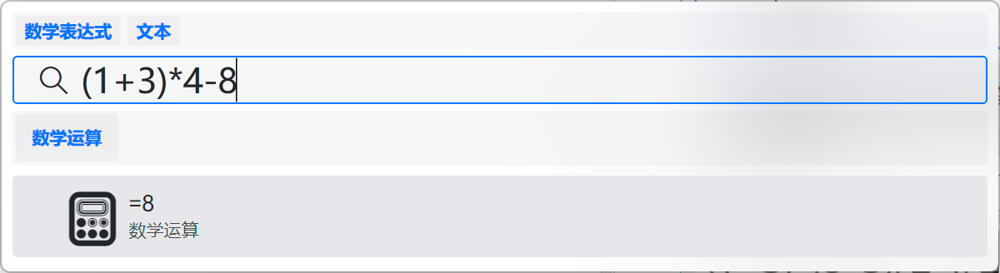
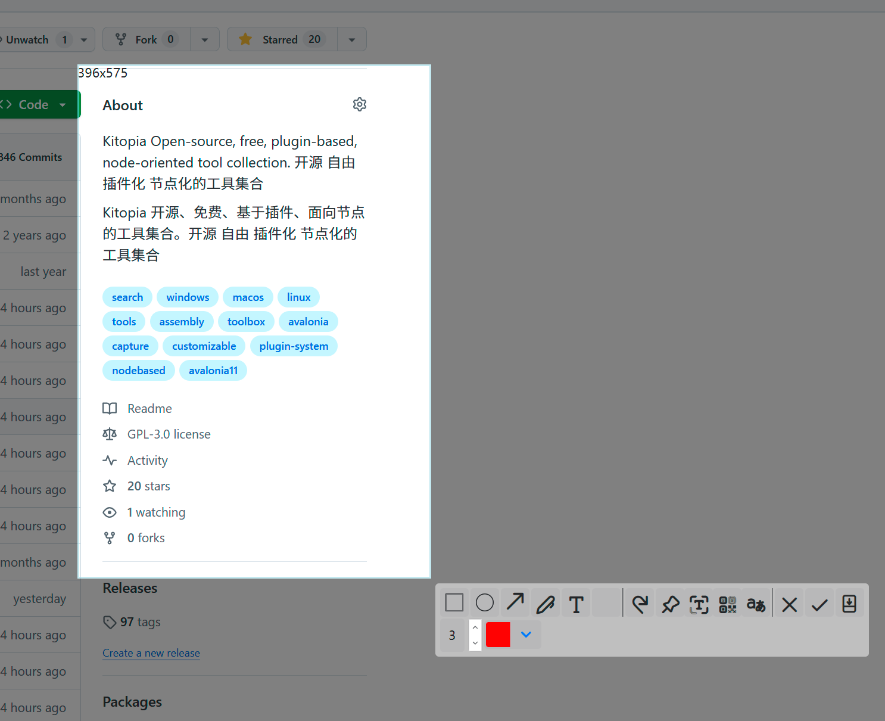
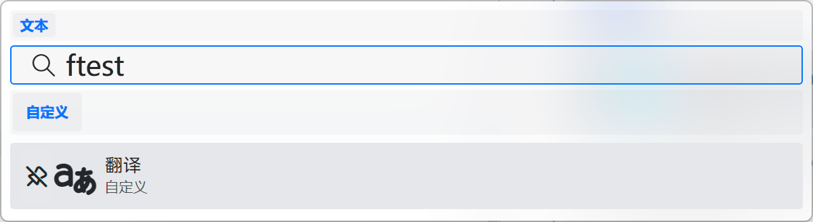
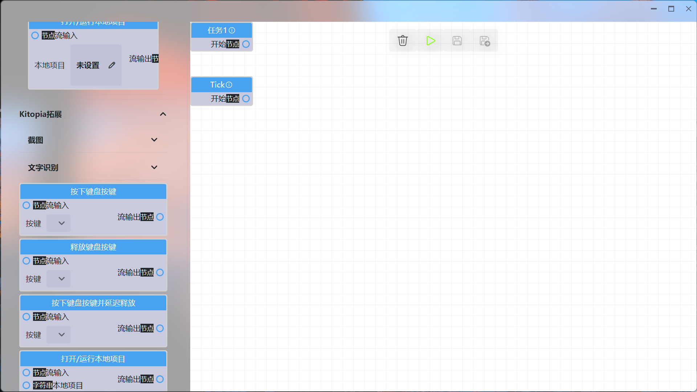
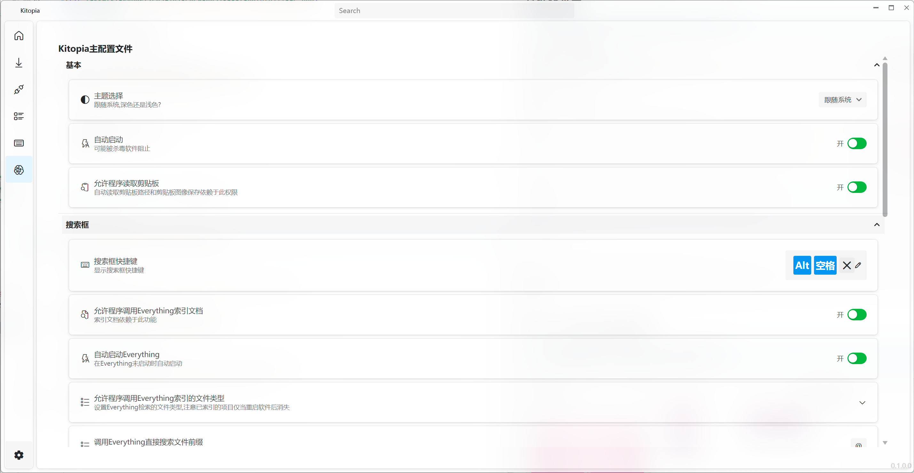

# Kitopia

[](https://deepwiki.com/Maklith/Kitopia)

> [English](/en-us/)

[](https://github.com/Maklith/Kitopia)
[](https://github.com/Maklith/Kitopia/releases)


**开源 · 插件化 · 节点化** 的桌面效率工具集合，集应用启动、文件与内容搜索、截图、翻译、自动化和局域网设备互传于一体。

## 简介

Kitopia 以搜索框和功能首页作为入口，可以直接使用内置工具，也可以通过插件扩展能力。节点化情景编辑器允许你连接软件和插件提供的功能，将截图、文字识别、翻译、剪贴板、键盘操作等组合成自己的工作流。

桌面端基于 Avalonia 开发，目前以 Windows 为主要支持平台。移动端 Kitopia Mobile 以局域网聊天和文件互传为主要功能，与桌面端共用通信协议和聊天界面。

## 下载与安装

前往 [GitHub Releases](https://github.com/Maklith/Kitopia/releases) 下载对应平台和架构的版本。发布版本可能落后于当前源码，具体功能以下载版本为准。

| 平台 | 当前范围 |
| --- | --- |
| Windows | 主要桌面平台，构建流程提供 `win-x64`、`win-arm64` 安装包和 ZIP 包。 |
| Android | Kitopia Mobile，构建流程提供 `android-arm64`、`android-x64` APK；最低 Android 6.0。 |
| Linux | 已有桌面平台适配项目，功能与 Windows 尚不完全一致。 |
| iOS | 已有移动端宿主项目，当前发布流程未提供 iOS 安装包。 |

Windows 的 Everything 搜索需要 Everything 已安装并运行，可以在设置中启用自动启动。OCR 和语义搜索需要相应的本地模型与可用的 ONNX 推理后端；截图二维码识别、截图翻译、贴图和图片压缩等扩展功能由 `KitopiaEx` 插件提供。

## 默认快捷键

| 操作 | 默认触发方式 |
| --- | --- |
| 打开或隐藏搜索框 | `Alt + Space` |
| 截图 | `Ctrl + Alt + Q` |
| 文件速览 | 在 Windows 资源管理器中选中文件后按 `Space` |
| 划词翻译 | `Ctrl + Alt + Y`，也支持鼠标拖选文字后自动触发 |
| 置顶窗口 | `Ctrl + Alt + T` |

以上为当前默认配置，可以在设置或快捷键管理中修改。快捷键支持键盘和鼠标触发，以及按进程设置生效范围。

## 主要功能

### 1. 搜索与启动

- **应用和文件启动**：搜索常规应用、UWP 应用、文件、文件夹和自定义情景。
- **拼音匹配**：支持中文名称的拼音搜索，结合历史记录、收藏和固定项目定位常用内容。
- **Everything 搜索**：默认以 `@` 开头查询文件，可调整前缀、结果数量和预索引文件类型。
- **本地语义搜索**：通过本地 BGE 模型匹配文件名称及文档内容，通过 Chinese-CLIP 模型按文字描述搜索已索引图片。
- **内容索引**：支持 DOCX、XLSX、PPTX、含可提取文本的 PDF，以及配置的纯文本格式，默认包含 Markdown。
- **结果操作**：打开、以管理员身份运行、打开所在目录、在终端中打开目录、收藏、固定和预览。
- **输入识别**：识别路径、网址、命令和数学表达式，也可读取剪贴板路径或保存剪贴板图片。
- **插件搜索能力**：通过插件增加翻译、窗口切换、窗口置顶等搜索结果。







### 2. 文件速览与索引管理

在 Windows 资源管理器中选中文件后按空格，可以打开文件速览；搜索结果也提供预览视图。

- **文件预览**：预览图片、文本、代码和 ZIP 等压缩包目录；文档和媒体等原生预览依赖系统已安装的预览处理程序。
- **图片查看**：支持缩放和拖动图片。
- **索引范围**：设置扫描目录、指定文件、允许的扩展名，以及要排除的目录和项目。
- **索引状态**：查看拼音、文档内容和图片索引的状态、进度及错误，按范围更新或重建索引。
- **资源控制**：可以调整语义搜索延迟、结果数量和 Windows 下索引任务的 CPU 使用上限。

### 3. 截图与图像处理

- **区域和窗口截图**：选择屏幕区域或窗口，支持多屏幕环境。
- **HDR 截图**：支持 HDR 画面捕获，实际效果取决于显示器、系统和截图后端。
- **长截图**：滚动捕获并拼接窗口内容。
- **标注工具**：矩形、圆形、箭头、画笔、文字、马赛克和模糊，支持撤销与重做。
- **取色**：查看和复制颜色值。
- **本地 OCR**：通过 PaddleOCR 模型提取截图中的文字。
- **截图扩展**：启用 `KitopiaEx` 后，可识别二维码、翻译截图文字、保存图片和将截图贴在屏幕上。

HDR 效果：


标注界面：



### 4. 翻译与图片压缩

- **划词翻译**：Windows 下读取选中文字，在浮窗中显示翻译；支持手动快捷键、自动划词、源语言和目标语言选择，以及按进程排除。
- **搜索框翻译**：`KitopiaEx` 提供翻译搜索结果，可以配置触发前缀和最短文本长度。
- **截图翻译**：识别截图文字后翻译，也可以在情景中使用文字和 OCR 结果翻译节点。
- **批量图片压缩**：`KitopiaEx` 提供按画质或目标体积压缩、无损选项、尺寸调整，以及 WebP、JPEG、PNG 输出。

翻译功能使用在线服务，需要网络连接；OCR 识别和语义索引在本地执行。



### 5. 局域网聊天与文件互传

桌面端的设备聊天页面和 Kitopia Mobile 可以发现同一局域网中的设备，并发送文字、图片及文件。

- **设备发现**：显示设备在线状态，支持设置广播名称和设备备注。
- **文字和图片**：发送文字消息、选择图片，或发送剪贴板中的可用内容。
- **文件传输**：发送多个文件，接收方可接受、拒绝并选择保存位置；支持进度显示和取消传输。
- **接收后操作**：打开文件、另存为或复制，具体操作取决于平台能力。
- **消息通知**：当前会话显示消息，其他会话或窗口未激活时通过通知提示。
- **移动端适配**：Android 端提供文件选择、接收保存、通知和前台通信服务。

设备通信通过局域网组播发现，使用 TCP 和 TLS 传输，不需要登录账号。设备需要处于可互通的局域网，防火墙和无线网络的客户端隔离设置会影响发现与传输。

### 6. 节点化情景

通过可视化编辑器连接节点，组合内置能力和插件功能。

- **功能编排**：连接输入、输出和执行流程，保存并运行自定义情景。
- **触发方式**：从搜索框运行，或配置运行、停止快捷键和插件提供的自动触发器。
- **插件节点**：使用截图、OCR、二维码、翻译、剪贴板、图片处理、应用启动和键盘模拟等节点。
- **情景市场**：浏览并导入已发布情景，登录后可上传情景及管理版本。



### 7. 插件、模型与功能管理

- **功能首页**：按分类浏览内置功能和已启用插件提供的功能。
- **插件市场**：浏览、安装和更新插件。
- **插件管理**：启用、停用、卸载插件，查看依赖并调整插件设置。
- **模型管理**：管理 ONNX 模型与推理设备，使用 CPU、Windows GPU 或 OpenVINO 等推理后端插件；可用后端取决于平台和硬件。
- **开发扩展**：插件 SDK 保留 `PluginCore` 公共命名空间和程序集标识，可以扩展功能入口、搜索、截图操作和情景节点。



### 8. Windows 系统增强

- **文件占用管理**：查看占用指定文件的进程，并选择结束进程释放文件。
- **资源管理器右键菜单**：通过配套组件接入文件操作和局域网分享。
- **窗口管理**：按标题查找并切换窗口，选择窗口置顶。
- **应用设置**：配置主题、强调色、语言、自动启动和更新检查。

## 数据与联网

桌面端配置、插件、情景、日志和接收文件由本地数据目录管理，Windows 下默认位于 `%LOCALAPPDATA%\Kitopia`。文件名、文档内容及图片的语义索引在本地建立。

Everything、截图、OCR、文件速览和局域网互传无需云端账号。翻译、插件及情景市场、账号和更新检查等功能会访问相应的网络服务。

## 开发与贡献

主要技术栈为 .NET 10、Avalonia、CommunityToolkit.Mvvm 和 Serilog；构建脚本使用 Fallout，Windows 安装器使用 Rust。

克隆仓库时初始化子模块：

```powershell
git clone --recurse-submodules https://github.com/Maklith/Kitopia.git
cd Kitopia
```

已有工作区可以运行 `git submodule update --init --recursive`。安装 .NET 10 SDK 后，可从仓库根目录进行桌面端构建和测试：

```powershell
dotnet restore "Kitopia.Desktop/Kitopia.Desktop.csproj"
dotnet build "Kitopia.Desktop/Kitopia.Desktop.csproj" -c Debug
dotnet test "KitopiaTest/KitopiaTest.csproj"
```

Windows Debug 构建会准备随应用分发的 FFmpeg 依赖，首次构建需要下载相关资源。Android 构建还需要 .NET Android workload 和 Android SDK；iOS 构建需要相应 workload、macOS 和 Xcode。

开发前请阅读仓库根目录的 `AGENTS.md`，其中列出了模块职责、依赖边界和针对性验证命令。构建脚本的 `Clean` 是打包发布流水线，部分目标会创建 GitHub Release 或上传插件，请按目标用途运行。

- [项目主页](https://github.com/Maklith/Kitopia)
- [提交 Issue](https://github.com/Maklith/Kitopia/issues)
- [插件 SDK](https://github.com/Maklith/PluginCore)
- [开源许可：GPL-3.0](https://github.com/Maklith/Kitopia/blob/HEAD/LICENSE)

